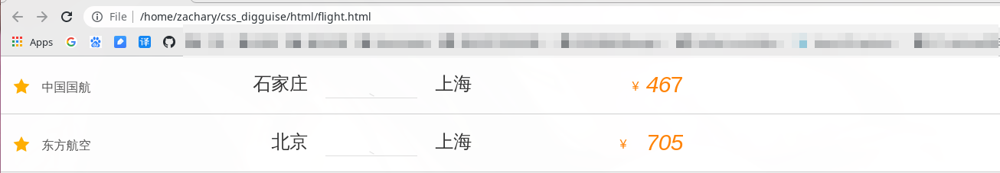
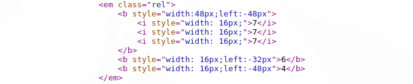

#### CSS 偏移反爬虫__ ------- 利用 CSS 样式将乱序的文字排版成人类可以正常阅读的顺序.

让我们看看下面这个网页:

 

可以看到有 2 个价格在上面, 分别是 *467* 和 *705*, 若我们想爬取这 2 个价格,先观察源码:

 

会发现网页源码中有两组数字, [7, 7, 7] 和 [6, 4],这十分奇怪,和我们看到价格不一样啊. 这是怎么一回事呢?

让我们仔细观察一下代码,会发现第 2 组数字的 `width` 属性都是 `16px`,但是第二组数字多了一个 'left' 属性且值都不一样. 进一步分析,可以看出这好似一个偏移量, '-32' 刚好是 2 倍的 `width` 值, 这样正好可以让 `6` 覆盖第二个 `7` ,其它的也是同理.

这样我们就可以通过 Python 代码来实现这一过程,获取正确的票价信息了.
